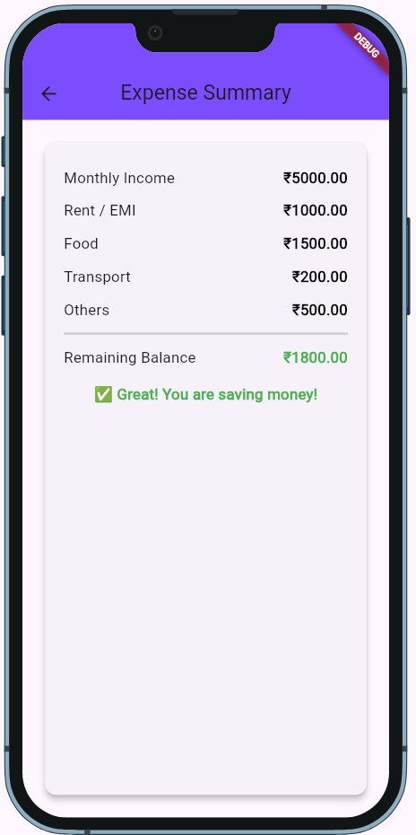

📱 Monthly Expense Manager App

A lightweight and elegant Flutter application to track and manage monthly expenses.
Built with a clean UI, multi-screen navigation, and fast offline functionality — no database required.

🌟 Overview

The Monthly Expense Manager helps users calculate and understand their monthly spending using a simple interface.
It uses structured navigation (MaterialApp routes), reusable widgets, and real-time calculations to deliver a smooth budgeting experience.

🚀 Features

✔️ Multi-screen navigation using MaterialApp

✔️ Clean and responsive UI

✔️ Real-time expense calculations

✔️ Reusable components & organized code

✔️ No backend / no database — fully offline

✔️ Fast, lightweight, and beginner-friendly

🧩 Project Structure
lib/
│
├── main.dart
├── input_screen.dart
└── result_screen.dart

main.dart – App initialization & routing

input_screen.dart – Accepts monthly expense inputs

result_screen.dart – Shows calculated totals

💡 Tech Used

Flutter

Dart

Material Design Widgets

🛠️ How It Works
1️⃣ Enter Your Expenses

Users input amounts for:

Food

Travel

Rent

Subscriptions

Miscellaneous

2️⃣ Navigate

User taps Calculate, and the app passes the values to the next screen.

3️⃣ Display Results

The result page shows:

Total monthly expenses

Remaining balance (if added)

Clean and minimal summary

🔗 Navigation Example
MaterialApp(
  title: 'Monthly Expense Manager',
  initialRoute: '/',
  routes: {
    '/': (context) => BudgetInputScreen(),
    '/result': (context) => ResultScreen(),
  },
);

🧮 Sample Code Snippet
Navigator.pushNamed(
  context,
  '/result',
  arguments: {
    'food': food,
    'travel': travel,
    'rent': rent,
  },
);

📦 Installation & Setup
1️⃣ Clone the Repository
git clone https://github.com/flare-fist/monthly-expense-manager.git
cd monthly-expense-manager

2️⃣ Install Dependencies
flutter pub get

3️⃣ Run the App
flutter run

🖼️ Screenshots

Add screenshots here once available:

assets/screenshots/
├── input_screen.png
└── result_screen.png

Example usage in README:

🚀 Future Enhancements

Add local storage using Hive / SharedPreferences

Add expenditure charts & analytics

Export monthly report as PDF

Add dark mode toggle

Category-wise insights

👨‍💻 Author

Melvin Matthew N

GitHub: https://github.com/flare-fist

LinkedIn: https://www.linkedin.com/in/melvin-matthew-n-30bb14301
